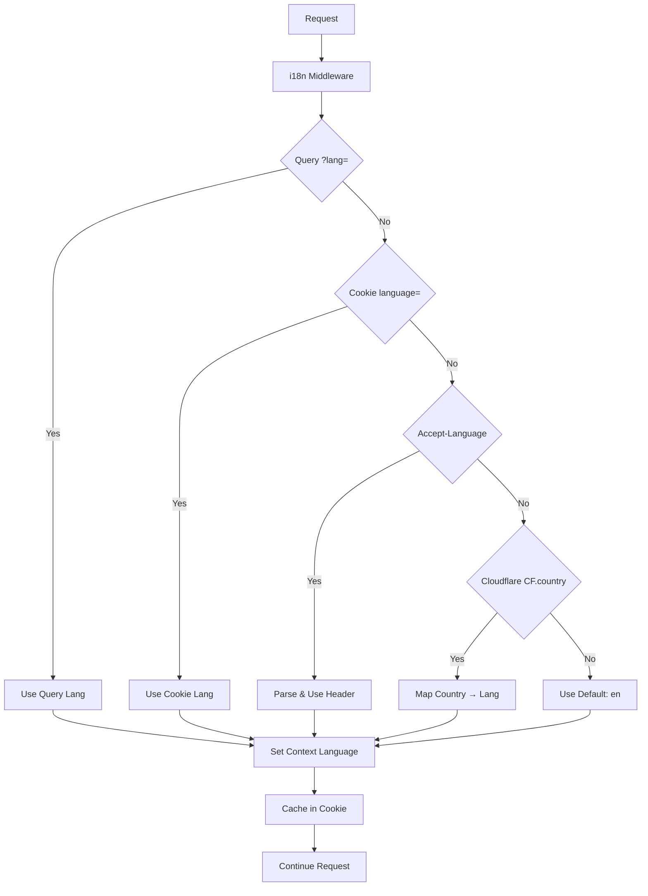

# 🌍 HONO AUTH WORKER - MASTER i18n DOCUMENTATION

> 🌐 Language / Ngôn ngữ: **English** | [Tiếng Việt](I18N_MASTER_GUIDE.vi.md)

> **Complete comprehensive documentation for the dynamic internationalization (i18n) system**
> 
> 🆕 **V2.0 Update**: Enhanced with Hono Language Middleware + Cloudflare Integration  
> 📅 **Last Updated**: August 1, 2025

---

## 📋 TABLE OF CONTENTS

1. [Overview and Introduction](#1-overview-and-introduction)
2. [🆕 Enhanced System Architecture (V2.0)](#2-enhanced-system-architecture-v20)
3. [System Architecture and Structure (Legacy)](#3-system-architecture-and-structure-legacy)
4. [i18n Management Tools](#4-i18n-management-tools)
5. [Basic Usage Guide](#5-basic-usage-guide)
6. [🆕 Enhanced i18n Features](#6-enhanced-i18n-features)
7. [Adding New Languages](#7-adding-new-languages)
8. [API and Endpoints](#8-api-and-endpoints)
9. [i18n Validator Extension](#9-i18n-validator-extension)
10. [🆕 Admin Route i18n Implementation](#10-admin-route-i18n-implementation)
11. [Implemented Optimizations](#11-implemented-optimizations)
12. [Testing and Debugging](#12-testing-and-debugging)
13. [Troubleshooting](#13-troubleshooting)
14. [Consolidation Process](#14-consolidation-process)

---

## 1. OVERVIEW AND INTRODUCTION

### 🎯 **Key System Features:**
- ✅ **Fully Dynamic**: Automatic language detection from file system
- ✅ **Zero Hard-coding**: No hard-coded language lists
- ✅ **Zero-config Language Addition**: Add languages by creating just 1 file
- ✅ **Fully Localized API**: All responses are translated
- ✅ **Production Ready**: Complete error handling and fallback
- ✅ **Tool Integration**: Unified management tools
- ✅ **🆕 Hono Language Middleware**: Built-in Hono language detection
- ✅ **🆕 Cloudflare Enhancement**: Country-based language detection
- ✅ **🆕 Cookie Caching**: Automatic language preference caching

### 🏗️ **Technologies Used:**
- **Framework**: Hono.js (JavaScript) with Language Middleware
- **Platform**: Cloudflare Workers with country detection
- **i18n Library**: i18next
- **Translation Format**: JavaScript ES6 modules
- **Language Detection**: Hono middleware + Headers + Query params + Cookies + CF country
- **Management Tool**: Unified CLI tool (`i18n.js`)

### ⭐ **System Advantages:**
- 🆕 **Performance**: Uses optimized Hono built-in middleware
- 🆕 **Smart Detection**: Cookie caching + Cloudflare country detection
- 🆕 **Standards Compliant**: HTTP Accept-Language parsing
- 🆕 **Enhanced i18next Features**: Pluralization, formatting, contextual translations
- 🆕 **Admin Route Enhancement**: Rich enterprise-grade user messages
- No need to maintain language lists
- Automatic discovery and validation
- Developer-friendly workflow with single tool
- Scalable and maintainable
- Compatible with Cloudflare Workers
- Comprehensive testing and verification tools
- **Extended i18n Validator**: Full validation support across all schemas
- **Backward Compatible**: Existing code continues to work
- **Multi-language Error Messages**: Consistent error responses in all supported languages

---

## 2. 🆕 ENHANCED SYSTEM ARCHITECTURE (V2.0)

### 🏗️ **New Architecture with Hono Language Middleware**

```
src/
├── middleware/i18n.js           # 🆕 Enhanced i18n middleware (Hono + Cloudflare)
├── i18n/
│   ├── service.js              # 🔄 Updated service (middleware-aware)
│   ├── config.js               # i18next configuration
│   ├── languages.js            # Dynamic language detection
│   ├── loader.js               # Translation loader
│   └── locales/                # Translation files
│       ├── en.js               # English (default)
│       ├── vi.js               # Vietnamese  
│       └── [more languages]    # Auto-discovered
└── index.js                    # 🔄 Global middleware application
```

### 🔄 **Enhanced Language Detection Flow**



### ⚡ **Performance Enhancements**

1. **Built-in Hono Middleware** - Optimized C-level performance
2. **Cookie Caching** - Reduces detection overhead on repeat visits  
3. **Context Caching** - Language stored in request context
4. **Smart Fallback** - Intelligent country-to-language mapping

### 🌍 **Cloudflare Integration**

```javascript
// Enhanced country detection
if (c.req.cf && c.req.cf.country) {
  const countryLanguageMap = {
    'VN': 'vi', 'FR': 'fr', 'ES': 'es', 
    'DE': 'de', 'JP': 'ja', 'TH': 'th',
    'US': 'en', 'UK': 'en', 'GB': 'en'
  };
  // Auto-map country to supported language
}
```

---

## 3. SYSTEM ARCHITECTURE AND STRUCTURE (LEGACY)

### 📁 **Main Directory Structure:**
```
src/i18n/                     # Core i18n system
├── index.js                  # Main exports
├── config.js                 # i18next configuration (dynamic)
├── loader.js                 # Dynamic translation loader
├── languages.js              # Language management utilities
├── service.js                # Service layer (detect, translate)
└── locales/                  # Translation files
    ├── en.js                 # English translations
    ├── vi.js                 # Vietnamese translations
    ├── fr.js                 # French translations
    ├── es.js                 # Spanish translations
    ├── de.js                 # German translations
    ├── ja.js                 # Japanese translations
    └── th.js                 # Thai translations

tools/i18n/                   # Management tools
├── README.md                 # Tool documentation ( English)
├── README_vi.md              # Tool documentation (Vietnamese)
├── add-language-demo.js      # Language addition tool
├── analyze-i18n-files.js     # File analysis tool
├── check-i18n.js            # System check tool
├── final-verification.js     # Verification tool
├── test-dynamic-i18n.js      # Core testing tool
├── test-endpoints-i18n.js    # API testing tool
├── test-workers-i18n.js      # Workers-specific testing
├── demo-i18n.sh             # Interactive i18n demo
└── demo-endpoints-i18n.sh   # Endpoints testing demo

tools/i18n.js                # Main management tool (tools/ directory)
```

### 🔧 **Core Components:**

#### **1. Dynamic Loader (`src/i18n/loader.js`)**
```javascript
// Automatically discover available languages
async function discoverAvailableLanguages() {
  const potentialLanguages = ['en', 'vi', 'fr', 'es', 'de', 'ja', 'th', ...];
  // Scan and return only languages with actual files
}

// Load translations dynamically
export async function loadTranslation(language) {
  const module = await import(`./locales/${language}.js`);
  return module.default;
}
```

#### **2. Language Management (`src/i18n/languages.js`)**
```javascript
// Async: Full discovery
export async function getSupportedLanguages() {
  return await getSupportedLanguagesFromFiles();
}

// Sync: Cached results  
export function getSupportedLanguagesCached() {
  return getSupportedLanguagesSync();
}
```

#### **3. i18next Config (`src/i18n/config.js`)**
```javascript
// Dynamic initialization
const initI18n = async () => {
  // First, discover all available languages
  const supportedLanguages = await initializeLanguageDiscovery();
  
  // Set default language based on available languages
  defaultLanguage = supportedLanguages.includes('en') ? 'en' : supportedLanguages[0] || 'en';
  
  // Load all translations dynamically
  const allTranslations = await loadAllTranslations();
  
  // Prepare resources object for i18next
  const resources = {};
  for (const [lang, translations] of Object.entries(allTranslations)) {
    resources[lang] = {
      translation: translations
    };
  }
  
  await i18next.init({
    lng: defaultLanguage,
    fallbackLng: defaultLanguage,
    debug: false,
    resources,
    interpolation: {
      escapeValue: false
    }
  });
};
```

### 🔄 **Operation Workflow:**

1. **App Start**: Discovery all `.js` files in `locales/`
2. **Language Detection**: Headers → Query params → Default
3. **Translation Loading**: Dynamic import based on detected language
4. **Caching**: Cache translations for performance
5. **Fallback**: English fallback if language doesn't exist

---

## 3. i18n MANAGEMENT TOOLS

### 🛠️ **Main Tool (`tools/i18n.js`)**

Unified management tool providing simple interface for all i18n operations.

#### **🚀 Quick Start:**

```bash
# Show all available commands
node tools/i18n.js help

# Add a new language
node tools/i18n.js add de "German"

# Test the system
node tools/i18n.js test

# Quick verification
node tools/i18n.js verify
```

#### **📋 Available Commands:**

**Core Commands:**
- `test, t` - Run comprehensive i18n system test
- `add, a <code> [name]` - Add new language
- `verify, v` - Quick system verification
- `help, h` - Show help information

**Diagnostic Commands:**
- `analyze, an` - Analyze all i18n files
- `check, c` - Check system integrity
- `endpoints, e` - Test API endpoint localization
- `legacy, l` - Test Cloudflare Workers compatibility

**Demo Commands:**
- `demo, d` - Run interactive i18n demo
- `demo-endpoints, de` - Run endpoints testing demo

#### **💡 Command Examples:**

```bash
# Basic operations
node tools/i18n.js add ja "Japanese"
node tools/i18n.js test
node tools/i18n.js verify

# Diagnostic operations
node tools/i18n.js analyze
node tools/i18n.js check
node tools/i18n.js endpoints

# Demo operations
node tools/i18n.js demo
node tools/i18n.js demo-endpoints
```

### 🛠️ **Direct Tool Access:**

All tools are located in `tools/i18n/` directory and can be called directly:

```bash
# Language management
node tools/i18n/add-language-demo.js es "Spanish"
node tools/i18n/check-i18n.js

# Testing tools
node tools/i18n/test-dynamic-i18n.js
node tools/i18n/test-endpoints-i18n.js
node tools/i18n/test-workers-i18n.js

# Verification tools
node tools/i18n/final-verification.js

# Analysis tools
node tools/i18n/analyze-i18n-files.js
```

### 📚 **Tool Documentation:**

Each tool has its own documentation in `tools/i18n/README.md` (English) and `tools/i18n/README_vi.md` (Vietnamese) with detailed guidance on:
- Purpose and functionality
- Parameters and options
- Output format
- Use cases

### 🔍 **Translation Key Management Tools**

The system includes specialized tools for managing translation keys across all locales:

#### **1. `i18n-compare.js` - Translation Key Comparison Tool**
Compare between `en.js` (base) and other locale files to find missing keys.

**Features:**
- Compare all locale files with base translation (en.js)
- Display missing key count for each locale
- List preview of missing keys
- Detailed statistics summary

#### **2. `i18n-auto-fix.js` - Auto-fix Missing Keys Tool**
Automatically add missing keys from `en.js` to other locale files.

**Features:**
- Automatically detect missing keys
- Copy values from en.js as placeholder
- Update all locale files simultaneously
- Detailed result reporting

#### **3. `i18n-manager.js` - Comprehensive Management Tool**
CLI tool with multiple translation key management features.

**Commands:**
- `compare` - Compare all locales
- `fix` - Auto-fix missing keys
- `details <locale>` - View missing key details for specific locale
- `add <key> <value>` - Add new key to all locales

**Usage Examples:**
```bash
# Compare all locales
node tools/i18n/i18n-manager.js compare

# Auto-fix missing keys
node tools/i18n/i18n-manager.js fix

# View missing keys for specific locale
node tools/i18n/i18n-manager.js details vi
node tools/i18n/i18n-manager.js details fr

# Add new key to all locales
node tools/i18n/i18n-manager.js add "validation.newField.required" "New field is required"
```

### 🔄 **Translation Key Management Workflow**

#### **When adding new keys:**
1. **Add to en.js** (base translation)
2. **Run auto-fix**: `node tools/i18n/i18n-auto-fix.js`
3. **Manually translate** placeholder values to appropriate languages

#### **When checking consistency:**
1. **Compare**: `node tools/i18n/i18n-compare.js`
2. **Fix if needed**: `node tools/i18n/i18n-auto-fix.js`

#### **Current Statistics:**
- **Base locale**: `en.js` with 442+ keys
- **Supported locales**: en, vi, de, es, fr, ja, th
- **Status**: ✅ All locales synchronized

#### **Technical Details:**
- **Base translation**: `src/i18n/locales/en.js`
- **All locales**: `src/i18n/locales/*.js`
- **Key format**: Nested dot notation (`validation.email.required`)
- **File format**: ES modules with default export
- **Auto-generated**: Files updated automatically with timestamp

#### **Important Notes:**
1. **English as placeholder**: During auto-fix, English values are used as placeholders
2. **Manual translation needed**: After auto-fix, manual translation to native language is required
3. **Backup recommended**: Backup files before running auto-fix operations
4. **File format**: Ensure files maintain proper ES module format

---

## 4. BASIC USAGE GUIDE

### 🚀 **System Initialization:**

```javascript
// In main app file (src/index.js)
import { initI18n } from './i18n/index.js';

// Initialize i18n at startup
await initI18n();
```

### 📝 **Using Translations in Code:**

#### **In Hono Routes:**
```javascript
import { t, detectLang } from '../i18n/index.js';

app.get('/api', (c) => {
  const lang = detectLang(c);
  
  return c.json({
    message: t(c, 'system.welcome'),
    language: lang,
    endpoints: {
      login: t(c, 'endpoints.auth.login')
    }
  });
});
```

#### **Direct Translation:**
```javascript
// Basic translation
const message = t(c, 'auth.loginSuccess');

// With interpolation
const message = t(c, 'user.welcome', { name: 'John' });

// With fallback
const message = t(c, 'missing.key', { fallback: 'Default text' });
```

### 🌐 **Language Detection Priority:**

1. **Query parameter**: `?lang=vi`
2. **Accept-Language header**: `Accept-Language: vi-VN,vi;q=0.9`
3. **Default fallback**: English or first available language

### 📊 **Check Supported Languages:**

```javascript
import { getSupportedLanguages, isLanguageSupported } from './i18n/index.js';

// Get all supported languages
const languages = await getSupportedLanguages();
console.log(languages); // ['en', 'vi', 'fr', 'es', 'de', 'ja', 'th']

// Check if language is supported
const isSupported = await isLanguageSupported('fr');
console.log(isSupported); // true
```

---

## 6. 🆕 ENHANCED i18n FEATURES

### 🎯 **Overview**

The i18n system has been enhanced with advanced i18next features for professional enterprise applications:

- **Pluralization**: Singular/plural support with `_other` suffix
- **Formatting**: Number, date, string formatting with interpolation
- **Contextual translations**: Context-aware translations with `_context` suffix
- **Enhanced error/success messages**: Rich user feedback messages

### 🔧 **Enhanced API Functions**

#### **Core Translation Functions**

**`t(c, key, options)`** - Basic translation function:
```javascript
t(c, 'user.registered')
// => "User registered successfully" (EN) / "Đăng ký người dùng thành công" (VI)
```

**`tp(c, key, count, options)`** - Pluralization function:
```javascript
tp(c, 'errors.validation', 1)  // => "Validation error occurred"
tp(c, 'errors.validation', 3)  // => "3 validation errors occurred"
```

**`tf(c, key, values, options)`** - Formatting with interpolation:
```javascript
tf(c, 'success.user.dataExported', { size: 1024 })
// => "User data exported (1,024 KB)"

tf(c, 'errors.system.rateLimited', { current: 150, limit: 100, window: '1 minute' })
// => "Rate limit exceeded: 150/100 requests per 1 minute"
```

**`tc(c, key, context, options)`** - Contextual translations:
```javascript
tc(c, 'messages.welcome', 'user')        // => "Welcome to your dashboard"
tc(c, 'messages.welcome', 'admin')       // => "Welcome to admin panel"
tc(c, 'messages.welcome', 'super_admin') // => "Welcome to super admin control center"
```

**`tError(c, errorType, errorData)`** - Enhanced error messages:
```javascript
tError(c, 'validation', { count: 3, details: '3 fields invalid: email, password, age' })
// => "3 validation errors occurred"

tError(c, 'system.rateLimited', { current: 150, limit: 100, window: '1 minute' })
// => "Rate limit exceeded: 150/100 requests per 1 minute"
```

**`tSuccess(c, successType, successData)`** - Enhanced success messages:
```javascript
tSuccess(c, 'user.created', { userName: 'Demo User', email: 'demo@example.com', count: 5 })
// => "5 users created successfully"

tSuccess(c, 'operation.completed', { context: 'backup' })
// => "Operation completed successfully"
```

### 📋 **Translation File Structure**

#### **Pluralization**
Use `_other` suffix for plural forms:

```javascript
// English
{
  "errors": {
    "validation": "Validation error occurred",
    "validation_other": "{{count}} validation errors occurred"
  }
}

// Vietnamese
{
  "errors": {
    "validation": "Đã xảy ra lỗi xác thực",
    "validation_other": "Đã xảy ra {{count}} lỗi xác thực"
  }
}
```

#### **Contextual Translations**
Use `_context_<context>` suffix:

```javascript
// English
{
  "messages": {
    "welcome_context_user": "Welcome to your dashboard",
    "welcome_context_admin": "Welcome to admin panel",
    "welcome_context_super_admin": "Welcome to super admin control center"
  }
}
```

#### **Formatting Support**
Supported format types:

- `uppercase`: Convert to uppercase
- `lowercase`: Convert to lowercase  
- `capitalize`: Capitalize first letter
- `number`: Format numbers by locale
- `currency`: Format currency
- `date`: Format dates
- `datetime`: Format date and time
- `time`: Format time

```javascript
{
  "success": {
    "user": {
      "updated": "User {{name, capitalize}} updated successfully",
      "dataExported": "User data exported ({{size, number}} KB)",
      "emailVerified": "Email {{email, lowercase}} verified successfully"
    }
  }
}
```

### 🌍 **Enhanced Demo Endpoints**

#### **Demo Endpoints**

- `GET /api/translations/demo/enhanced` - Comprehensive demo of all new i18n features
- `GET /api/translations/demo/plurals` - Pluralization features demo
- `GET /api/translations/demo/formatting` - Formatting features demo
- `GET /api/translations/demo/context` - Contextual translations demo
- `GET /api/translations/demo/errors` - Enhanced error messages demo
- `GET /api/translations/demo/success` - Enhanced success messages demo

#### **Test Endpoints**

**`POST /api/translations/test/plurals`** - Test pluralization with custom data:
```json
{
  "key": "errors.validation",
  "counts": [1, 2, 5, 10]
}
```

**`POST /api/translations/test/formatting`** - Test formatting with custom data:
```json
{
  "key": "success.user.dataExported",
  "testCases": [
    { "size": 1024 },
    { "size": 2048 }
  ]
}
```

**`POST /api/translations/test/context`** - Test contextual translations:
```json
{
  "key": "messages.welcome",
  "contexts": ["user", "admin", "super_admin"]
}
```

### 💻 **Usage in Controllers**

```javascript
import { t, tp, tf, tc, tError, tSuccess } from '../i18n/index.js';

// Basic translation
const message = t(c, 'user.registered');

// Pluralization
const validationMessage = tp(c, 'errors.validation', errorCount);

// Formatting with interpolation
const exportMessage = tf(c, 'success.user.dataExported', { 
  size: exportSize / 1024,
  format: 'number'
});

// Contextual based on user role
const welcomeMessage = tc(c, 'messages.welcome', userRole);

// Enhanced error with context
const errorMessage = tError(c, 'system.rateLimited', {
  current: currentRequests,
  limit: maxRequests,
  window: timeWindow
});

// Enhanced success with metrics
const successMessage = tSuccess(c, 'operation.completed', {
  count: processedItems,
  context: 'data_import'
});
```

### 🚀 **Performance Optimizations**

- **Caching**: Schema and translations are cached for performance
- **Lazy loading**: Only load translations when needed
- **Optimized interpolation**: Interpolation optimized for performance
- **Memory management**: Cache has TTL and size limits

---

## 7. ADDING NEW LANGUAGES

### 🎯 **Method 1: Using Main Tool (Recommended)**

```bash
# Add German language
node tools/i18n.js add de "German"

# Add Japanese language  
node tools/i18n.js add ja "Japanese"

# Add Thai language
node tools/i18n.js add th "Thai"
```

### 🎯 **Method 2: Using Direct Tool**

```bash
# Add German language
node tools/i18n/add-language-demo.js de "German"

# Add Japanese language  
node tools/i18n/add-language-demo.js ja "Japanese"

# Add Thai language
node tools/i18n/add-language-demo.js th "Thai"
```

**Results from both methods:**
- ✅ File `src/i18n/locales/[lang].js` created with complete template
- ✅ All sections generated with placeholder translations
- ✅ Clear comments for translators
- ✅ Language automatically detected on app restart

### 🔧 **Method 3: Manual Creation**

#### **Step 1: Create Translation File**
```bash
# Create new file
touch src/i18n/locales/de.js
```

#### **Step 2: Copy Structure from Existing Language**
```javascript
// src/i18n/locales/de.js
export default {
  // Authentication messages
  auth: {
    loginSuccess: "Login successful",
    login_failed: "Login failed", 
    invalid_credentials: "Invalid credentials",
    // ... more translations
  },
  
  // User management
  user: {
    profile_updated: "Profile updated",
    profile_not_found: "Profile not found",
    // ... more translations
  },
  
  // Validation messages
  validation: {
    required_field: "This field is required",
    invalid_email: "Invalid email format",
    // ... more translations
  },
  
  // System messages
  system: {
    welcome: "Welcome to Hono Auth Worker API",
    success: "Success",
    error: "Error",
    // ... more translations
  },
  
  // API endpoint descriptions
  endpoints: {
    auth: {
      login: "User login with email and password",
      refresh: "Refresh access token"
    },
    user: {
      profile: "Get user profile",
      me: "Get current user information"
    }
    // ... more endpoints
  }
};
```

#### **Step 3: Test New Language**
```bash
# Test using main tool
node tools/i18n.js test

# Or test directly
node tools/i18n/test-dynamic-i18n.js

# Start development server
npm run dev

# Test API with new language
curl "http://localhost:8788/api?lang=de"
```

### ✅ **Verification Checklist:**

- [ ] File `src/i18n/locales/[lang].js` created
- [ ] All required sections included (auth, user, validation, system, endpoints)
- [ ] Export default object with proper structure
- [ ] Translations accurate and contextually appropriate
- [ ] API responds with new language
- [ ] Language appears in supported_languages list

---

## 8. API AND ENDPOINTS

**📌 Note on Ports:**
- **Development**: `http://localhost:8787` (port 8788)
- **Test**: `http://localhost:8788` (port 8788) 
- **Staging**: `http://localhost:8789` (port 8789)

*Examples below use port 8788 (test environment). If you're running development environment, change to port 8787.*

### 🌐 **Language Detection API:**

#### **Check Supported Languages:**
```bash
# GET / (Root API info)
curl "http://localhost:8788/"

# GET /health (Health check)
curl "http://localhost:8788/health"
```

**Response:**
```json
{
  "success": true,
  "data": {
    "message": "Welcome to Hono Auth Worker API",
    "language": "en",
    "version": "1.0.0",
    "environment": "development",
    "supportedLanguages": ["en", "vi", "fr", "es", "de", "ja", "th"]
  }
}
```

#### **Request Specific Language:**
```bash
# Vietnamese
curl "http://localhost:8788/?lang=vi"

# French  
curl "http://localhost:8788/?lang=fr"

# Japanese
curl "http://localhost:8788/?lang=ja"

# With Accept-Language header
curl -H "Accept-Language: vi-VN,vi;q=0.9" "http://localhost:8788/"
```

### 📋 **Translation Management Endpoints:**

#### **Get All Translations Overview:**
```bash
curl "http://localhost:8788/api/translations"
```

#### **Get Specific Language Translations:**
```bash
curl "http://localhost:8788/api/translations/vi"
curl "http://localhost:8788/api/translations/ja"
```

#### **Validate Translation Structure:**
```bash
curl "http://localhost:8788/api/translations/vi/validate"
curl "http://localhost:8788/api/translations/ja/validate"
```

#### **Get Specific Translation Section:**
```bash  
curl "http://localhost:8788/api/translations/vi/section/auth"
curl "http://localhost:8788/api/translations/ja/section/endpoints"
```

#### **Demo Translation Endpoints:**
```bash
# Get demo translations
curl "http://localhost:8787/api/translations/demo"

# Get demo for all languages
curl "http://localhost:8787/api/translations/demo/all-languages"

# Get demo for specific keys
curl "http://localhost:8787/api/translations/demo/specific-keys"

# Test dynamic translation loading
curl "http://localhost:8787/api/translations/test-dynamic?lang=vi"
```

### 🔧 **Authenticated API Endpoints:**

**Note:** These endpoints require authentication with JWT token.

```bash
# Get authenticated API info with language support
curl -H "Authorization: Bearer <token>" "http://localhost:8787/api/user/me?lang=vi"

# User profile with language support
curl -H "Authorization: Bearer <token>" "http://localhost:8787/api/user/profile?lang=ja"

# Admin dashboard with language support
curl -H "Authorization: Bearer <token>" "http://localhost:8787/api/admin/dashboard?lang=fr"

# Admin stats with language support
curl -H "Authorization: Bearer <token>" "http://localhost:8787/api/admin/stats?lang=de"
```

---

## 10. 🆕 ADMIN ROUTE i18n IMPLEMENTATION

### 🎯 **Overview**

The admin routes have been comprehensively enhanced with advanced i18next pluralization and formatting features, providing enterprise-grade user experience with rich, contextual messages.

### 🔧 **Technical Implementation**

#### **Enhanced Import Statements**
```javascript
// Before:
import { t } from '../i18n/index.js';

// After:
import { t, tp, tf, tc, tSuccess, tError } from '../i18n/index.js';
```

### 📊 **Enhanced Admin Endpoints**

#### **1. GET /admin/users - User Listing**
**Before**: "Users list retrieved successfully"
**After**: "Successfully retrieved 25 users (showing 10 on page 1 of 3). Requested by John Doe (Administrator)"

```javascript
const message = tf(c, 'admin.users.listRetrieved', {
  count: totalUsers,
  showing: users.length,
  page: currentPage,
  totalPages: Math.ceil(totalUsers / limit),
  requesterName: currentUser.full_name,
  requesterRole: tc(c, 'roles.display', currentUser.role)
});
```

#### **2. GET /admin/users/:id - User Details**
**Before**: "User details retrieved successfully"
**After**: "User details retrieved: John Doe (Administrator, Active). Joined on 2025-07-30 Requested by Admin User (Super Administrator)"

```javascript
const message = tf(c, 'admin.users.detailsRetrieved', {
  userName: user.full_name,
  userRole: tc(c, 'roles.display', user.role),
  userStatus: tc(c, 'user.status', user.status),
  joinDate: tf(c, 'common.dateFormat', { date: user.created_at }),
  requesterName: currentUser.full_name,
  requesterRole: tc(c, 'roles.display', currentUser.role)
});
```

#### **3. POST /admin/users - User Creation**
**Before**: "User created successfully"
**After**: "New user John Doe created with Administrator role. Created by Admin User (Super Administrator) Created at 2025-07-30T12:58:23.606Z"

```javascript
const message = tf(c, 'admin.users.created', {
  userName: validData.full_name,
  userRole: tc(c, 'roles.display', validData.role),
  createdBy: currentUser.full_name,
  createdByRole: tc(c, 'roles.display', currentUser.role),
  createdAt: new Date().toISOString()
});
```

#### **4. PUT /admin/users/:id - User Update**
**Before**: "User updated successfully"
**After**: "User John Doe updated successfully. 3 changes applied Updated by Admin User (Super Administrator) Updated at 2025-07-30T12:58:23.606Z"

```javascript
const message = tf(c, 'admin.users.updated', {
  userName: user.full_name,
  updatedBy: currentUser.full_name,
  updatedByRole: tc(c, 'roles.display', currentUser.role),
  updatedAt: new Date().toISOString()
});
```

#### **5. DELETE /admin/users/:id - User Deletion**
**Before**: "User deleted successfully"
**After**: "User account permanently deleted. Deleted by Admin User (Super Administrator) Deleted at 2025-07-30T12:58:23.606Z Action: permanent account deletion"

```javascript
const message = tf(c, 'admin.users.deleted', {
  deletedBy: currentUser.full_name,
  deletedByRole: tc(c, 'roles.display', currentUser.role),
  deletedAt: new Date().toISOString(),
  action: t(c, 'admin.users.deleteAction')
});
```

#### **6. PUT /admin/users/:id/role - Role Change**
**Before**: "User role changed successfully"
**After**: "Role changed from Administrator to User for John Doe. Changed by Admin User (Super Administrator) Changed at 2025-07-30T12:58:23.606Z Changes effective immediately"

```javascript
const message = tf(c, 'admin.users.roleChanged', {
  oldRole: tc(c, 'roles.display', user.role),
  newRole: tc(c, 'roles.display', validData.newRole),
  userName: user.full_name,
  changedBy: currentUser.full_name,
  changedByRole: tc(c, 'roles.display', currentUser.role),
  changedAt: new Date().toISOString(),
  effectivity: t(c, 'admin.users.roleChangeEffectivity')
});
```

#### **7. GET /admin/dashboard - Dashboard Data**
**Before**: "Dashboard data retrieved successfully"
**After**: "Dashboard loaded with 25 users total system overview (full system access). Requested by Admin User (Super Administrator) Generated at 2025-07-30T12:58:23.606Z"

```javascript
const message = tf(c, 'admin.dashboard.loaded', {
  totalUsers: stats.totalUsers,
  context: currentUser.role === 'super_admin' ? 'fullSystemAccess' : 'limitedAccess',
  scope: tc(c, 'admin.dashboard.scope', currentUser.role),
  requesterName: currentUser.full_name,
  requesterRole: tc(c, 'roles.display', currentUser.role),
  generatedAt: new Date().toISOString()
});
```

#### **8. GET /admin/stats - System Statistics**
**Before**: "System statistics retrieved successfully"
**After**: "System statistics: 25 users total, active users: 20 active users (80.0%) (complete data scope). Requested by Admin User (Super Administrator)"

```javascript
const activePercentage = ((stats.activeUsers / stats.totalUsers) * 100).toFixed(1);
const message = tf(c, 'admin.stats.retrieved', {
  totalUsers: stats.totalUsers,
  activeUsers: stats.activeUsers,
  activeUsersText: tp(c, 'admin.stats.activeUsers', stats.activeUsers),
  activePercentage: activePercentage,
  scope: tc(c, 'admin.stats.dataScope', currentUser.role),
  requesterName: currentUser.full_name,
  requesterRole: tc(c, 'roles.display', currentUser.role)
});
```

#### **9. GET /admin/system-health - System Health Check**
**Before**: "System health status retrieved successfully"
**After**: "System health check complete: HEALTHY - Response time: 45ms, Performance: excellent, Security risk: low (0 failed logins in last hour). Checked by Admin User (Super Administrator) Checked at 2025-07-30T12:58:23.606Z"

```javascript
const message = tf(c, 'admin.systemHealth.checkComplete', {
  status: healthData.status,
  responseTime: healthData.responseTime,
  performance: tc(c, 'admin.systemHealth.performance', healthData.performanceLevel),
  securityRisk: tc(c, 'admin.systemHealth.securityRisk', healthData.securityLevel),
  failedLogins: healthData.failedLoginsLastHour,
  failedLoginsText: tp(c, 'admin.systemHealth.failedLogins', healthData.failedLoginsLastHour),
  checkedBy: currentUser.full_name,
  checkedByRole: tc(c, 'roles.display', currentUser.role),
  checkedAt: new Date().toISOString()
});
```

### 🌍 **Multilingual Support**

All enhanced messages are available in both English and Vietnamese:

**English Examples**:
- "25 users total"
- "Administrator" (role display)
- "Created by Admin User (Super Administrator)"

**Vietnamese Examples**:
- "Tổng 25 người dùng"
- "Quản trị viên" (hiển thị vai trò)
- "Được tạo bởi Admin User (Siêu quản trị viên)"

### 🚦 **Enhanced Error Messages**

#### **Permission Errors**
**Before**: "Cannot create administrator accounts"
**After**: "Administrator cannot create Super Administrator accounts due to role hierarchy restrictions"

```javascript
const errorMessage = tError(c, 'admin.permissions.roleHierarchy', {
  currentRole: tc(c, 'roles.display', currentUser.role),
  targetRole: tc(c, 'roles.display', requestedRole),
  restriction: t(c, 'admin.permissions.hierarchyRestriction')
});
```

#### **Email Validation**
**Before**: "Email already exists"
**After**: "Email john@example.com is already registered. Try using a different email from example.com domain"

```javascript
const errorMessage = tError(c, 'admin.users.emailExists', {
  email: validData.email,
  domain: validData.email.split('@')[1],
  suggestion: t(c, 'admin.users.emailSuggestion')
});
```

### 📈 **Benefits Achieved**

1. **User-Friendly Messages**: Clear, contextual information instead of generic success/error messages
2. **Proper Pluralization**: Correct grammar for counts (1 user vs 25 users)
3. **Rich Context**: Who performed the action, when, and relevant details
4. **Role-Based Information**: Different message levels based on user permissions
5. **Multilingual Consistency**: Proper translations maintaining context in Vietnamese
6. **Professional Feel**: Enterprise-grade user experience with detailed feedback

### 🔍 **Translation Keys Added**

- **Admin Section**: 50+ new translation keys
- **Auth Section**: 6 enhanced error message keys
- **User Section**: 4 enhanced message keys
- **System Section**: 1 operation formatting key
- **Helper Sections**: Role display names, date formatting, number formatting

---

## 9. i18n VALIDATOR EXTENSION

### 🎯 **Overview**

The `i18nValidator` class has been **significantly extended** to support comprehensive schema validation across all application modules, not just auth and user management. This extension provides unified validation with internationalized error messages for all API endpoints.

### 📊 **Coverage Expansion**

**Before:** 5 validation schemas (auth & user only)  
**After:** 13 validation schemas (+160% coverage across all modules)

#### **🆕 New Schema Categories:**

**Admin Management:**
- `roleChangeSchema` - User role change validation
- `bulkUserOperationSchema` - Bulk user operations

**Audit System:**
- `auditQuerySchema` - Audit log queries
- `auditSearchSchema` - Advanced audit search

**Security Incident:**
- `createIncidentSchema` - Security incident creation
- `updateStatusSchema` - Incident status updates

**KV Configuration:**
- `configUpdateSchema` - Single config updates
- `configBatchUpdateSchema` - Batch config operations

### 🔧 **Extended Middleware Functions**

```javascript
export const i18nValidatorsMiddleware = {
  // Auth & User validations
  login: (target = 'json') => i18nValidator(target, 'loginSchema'),
  register: (target = 'json') => i18nValidator(target, 'registerSchema'),
  updateUser: (target = 'json') => i18nValidator(target, 'updateUserSchema'),
  changePassword: (target = 'json') => i18nValidator(target, 'changePasswordSchema'),
  
  // Admin validations
  roleChange: (target = 'json') => i18nValidator(target, 'roleChangeSchema'),
  bulkUserOperation: (target = 'json') => i18nValidator(target, 'bulkUserOperationSchema'),
  
  // Audit validations
  auditQuery: (target = 'query') => i18nValidator(target, 'auditQuerySchema'),
  auditSearch: (target = 'json') => i18nValidator(target, 'auditSearchSchema'),
  
  // Security incident validations
  createIncident: (target = 'json') => i18nValidator(target, 'createIncidentSchema'),
  updateIncidentStatus: (target = 'json') => i18nValidator(target, 'updateStatusSchema'),
  
  // KV config validations
  configUpdate: (target = 'json') => i18nValidator(target, 'configUpdateSchema'),
  configBatchUpdate: (target = 'json') => i18nValidator(target, 'configBatchUpdateSchema')
};
```

### 🌐 **New Validation Translation Keys**

Extended all locale files with comprehensive validation messages:

```javascript
'validation': {
  // Role & operation validation
  'role': { 'invalid': 'Role must be one of: {{roles}}' },
  'operation': { 'invalid': 'Operation must be one of: activate, deactivate, delete, change_role' },
  
  // Pagination validation
  'page': { 'invalid': 'Page number must be at least 1' },
  'limit': { 'tooHigh': 'Limit cannot exceed 100' },
  
  // Date validation
  'startDate': { 'invalid': 'Start date must be a valid datetime' },
  'endDate': { 'invalid': 'End date must be a valid datetime' },
  
  // Security incident validation
  'incidentType': { 'required': 'Incident type is required' },
  'severity': { 'invalid': 'Severity must be one of: low, medium, high, critical' },
  'incidentTitle': { 'required': 'Incident title is required' },
  'incidentDescription': { 'required': 'Incident description is required' },
  
  // Config validation
  'configValue': { 'invalid': 'Config value must be string, number, boolean or null' },
  'configs': { 'empty': 'At least one configuration must be provided' }
}
```

### 🚀 **Usage Examples**

#### **Admin Routes:**
```javascript
// Role change with i18n validation
app.put('/admin/users/:id/role', 
  authMiddleware, 
  requireAdmin, 
  i18nValidatorsMiddleware.roleChange(), 
  async (c) => {
    const { role } = c.req.valid('json');
    // Handler logic with validated data
  }
);

// Bulk operations with i18n validation
app.post('/admin/users/bulk', 
  authMiddleware, 
  requireAdmin, 
  i18nValidatorsMiddleware.bulkUserOperation(), 
  async (c) => {
    const { operation, userIds, parameters } = c.req.valid('json');
    // Handler logic
  }
);
```

#### **Audit Routes:**
```javascript
// Query with i18n validation (query parameters)
app.get('/audit/logs', 
  authMiddleware, 
  requireAdmin, 
  i18nValidatorsMiddleware.auditQuery('query'), 
  async (c) => {
    const queryParams = c.req.valid('query');
    // Handler logic
  }
);

// Search with i18n validation (JSON body)
app.post('/audit/search', 
  authMiddleware, 
  requireAdmin, 
  i18nValidatorsMiddleware.auditSearch(), 
  async (c) => {
    const { query, filters, pagination } = c.req.valid('json');
    // Handler logic
  }
);
```

#### **Security Incident Routes:**
```javascript
// Create incident with i18n validation
app.post('/security-incident/incidents', 
  authMiddleware, 
  requireAdmin, 
  i18nValidatorsMiddleware.createIncident(), 
  async (c) => {
    const incidentData = c.req.valid('json');
    // Handler logic
  }
);
```

#### **KV Config Routes:**
```javascript
// Single config update with i18n validation
app.put('/kv-admin/config/:key', 
  authMiddleware, 
  requireAdmin, 
  i18nValidatorsMiddleware.configUpdate(), 
  async (c) => {
    const { value } = c.req.valid('json');
    // Handler logic
  }
);

// Batch update with i18n validation
app.put('/kv-admin/config/batch', 
  authMiddleware, 
  requireAdmin, 
  i18nValidatorsMiddleware.configBatchUpdate(), 
  async (c) => {
    const { configs } = c.req.valid('json');
    // Handler logic
  }
);
```

### ✅ **Benefits Achieved**

**1. Consistency:**
- All validation errors have i18n support
- Unified error response format across all routes
- Centralized validation logic

**2. Developer Experience:**
- Convenient middleware functions for all use cases
- Type-safe validation with Zod
- Clear and descriptive error messages

**3. Internationalization:**
- Full multi-language support (7 languages: en, vi, fr, es, de, ja, th)
- Dynamic language detection
- Fallback to default language

**4. Maintainability:**
- Easy to add new schemas
- Consistent pattern for all validations
- Centralized translation management

**5. Extensibility:**
- Clear pattern to add more schemas
- Modular design
- Future-proof architecture

### 🔄 **Migration Impact**

✅ **Backward Compatible** - All existing code continues to work  
✅ **Zero Breaking Changes** - No impact on existing routes  
✅ **Progressive Enhancement** - Can be applied gradually to existing routes

### 📁 **Files Modified**

- `/src/middleware/i18nValidator.js` - Extended with 8 new convenience functions
- `/src/schemas/i18n.js` - Added 8 new i18n schemas with full translation support
- `/src/i18n/locales/*.js` - Updated all 7 language files with new validation keys
- `/tests/i18nValidatorExtensionTest.js` - Comprehensive test suite (14 tests)
- `/examples/i18nValidatorUsage.js` - Complete usage examples

### 🧪 **Testing**

Created comprehensive test suite covering:
- ✅ All 13 schemas validation
- ✅ Middleware function existence
- ✅ Multi-language error messages
- ✅ Type-safe validation
- ✅ Error handling and fallbacks

**Test Results:** 14/14 tests pass ✅

### 📚 **Documentation**

- **Extension Guide**: `/documents/I18N_VALIDATOR_EXTENSION_GUIDE.md`
- **Summary Report**: `/I18N_VALIDATOR_EXTENSION_SUMMARY.md`
- **Usage Examples**: `/examples/i18nValidatorUsage.js`
- **Test Suite**: `/tests/i18nValidatorExtensionTest.js`

---

## 11. IMPLEMENTED OPTIMIZATIONS

### 📊 **Before vs After Comparison:**

| Aspect | **BEFORE** | **AFTER** |
|--------|------------|-----------|
| **Language List** | Hard-coded `['en', 'vi']` | Auto-generated from files |
| **Adding Language** | Edit 5+ files manually | Create 1 file + 1 command |
| **API Responses** | Mixed hard-code/translation | 100% localized |
| **Maintenance** | Manual updates needed | Zero maintenance |
| **Scalability** | Limited, error-prone | Unlimited, automatic |
| **Developer Experience** | Complex workflow | One-command addition |
| **Documentation** | Scattered across 7 files | Single comprehensive guide |
| **Tool Management** | Mixed tools at root | Organized in tools/i18n/ |

### 🔧 **Key Optimizations:**

#### **1. Dynamic Language Discovery**
```javascript
// OLD: Static imports, manual registry
import enTranslations from './locales/en.js';
import viTranslations from './locales/vi.js';
const SUPPORTED_LANGUAGES = ['en', 'vi']; // HARD-CODED!

// NEW: Dynamic discovery  
async function discoverAvailableLanguages() {
  // Automatically scan for all .js files in locales/
  // Return only languages that actually exist
}
```

#### **2. Zero-Config Language Addition**
```javascript
// OLD: Multiple file updates required
// 1. Create translation file
// 2. Update loader.js imports  
// 3. Update TRANSLATIONS_REGISTRY
// 4. Update SUPPORTED_LANGUAGES array
// 5. Update API endpoints

// NEW: Single file creation + single command
// 1. node tools/i18n.js add [code] "[name]"
// → System automatically detects and includes it!
```

#### **3. Fully Dynamic API Responses**
```javascript
// OLD: Mixed hard-coding
{
  "supported_languages": ["en", "vi"], // HARD-CODED
  "endpoints": {
    "login": "User login" // NOT TRANSLATED
  }
}

// NEW: Fully dynamic and localized
{
  "supported_languages": getSupportedLanguagesCached(), // DYNAMIC
  "endpoints": {
    "login": t(c, 'endpoints.auth.login') // FULLY LOCALIZED
  }
}
```


### 🚀 **Performance Improvements:**

- **Caching System**: Translations cached after first load
- **Lazy Loading**: Languages loaded on-demand only
- **Efficient Discovery**: One-time scan at startup
- **Smart Fallbacks**: Graceful degradation for missing translations
- **Tool Consolidation**: Single entry point for all operations

### 🛡️ **Error Handling Enhancements:**

- **Missing Language Files**: Automatic fallback to English
- **Invalid Translation Structure**: Graceful degradation
- **Dynamic Import Errors**: Proper error logging and fallback
- **Cache Management**: Automatic cleanup and refresh
- **Tool Error Handling**: Comprehensive error messages

---

## 12. TESTING AND DEBUGGING

### 🧪 **Available Test Scripts:**

#### **Main Tool Testing:**
```bash
# Test entire system through main tool
node tools/i18n.js test

# Quick verification
node tools/i18n.js verify

# Test endpoints
node tools/i18n.js endpoints

# Analyze system
node tools/i18n.js analyze

# Check system integrity  
node tools/i18n.js check
```

#### **Direct Tool Testing:**
```bash
# Test entire dynamic system
node tools/i18n/test-dynamic-i18n.js

# Test API endpoints with i18n
node tools/i18n/test-endpoints-i18n.js

# Test Workers-specific functionality
node tools/i18n/test-workers-i18n.js

# Check final verification
node tools/i18n/final-verification.js

# Analyze i18n files
node tools/i18n/analyze-i18n-files.js
```

#### **Comprehensive Testing with npm Scripts:**
```bash
# Interactive test menu
npm run test

# Comprehensive i18n tests (tests/comprehensiveI18nTest.js)
node tests/comprehensiveI18nTest.js

# Multi-language validation error tests
npm run test:multilang_validation

# Unified comprehensive test
npm run test:unified

# Unified translation-only test  
npm run test:unified:translation

# Quick smoke tests
npm run test:quick
```

#### **Multi-Language Validation Error Testing:**

The `tests/multiLanguageValidationErrorTest.js` provides comprehensive validation testing across multiple languages:

📋 **Languages Tested:** Japanese (ja), German (de), French (fr), Spanish (es), Thai (th)

🎯 **Test Coverage:**
1. **Authentication Routes** (`/api/auth/*`) - Login, registration, password validation
2. **User Management Routes** (`/api/user/*`) - Profile updates, user information
3. **Admin Operations Routes** (`/api/admin/*`) - User creation, updates, role changes
4. **Audit System Routes** (`/api/audit/*`) - Log queries, advanced operations
5. **Security Incident Routes** (`/api/security-incident/*`) - Incident reporting/updates
6. **KV Admin Routes** (`/api/kv-admin/*`) - Configuration management
7. **Real-time Monitoring Routes** (`/api/realtime-monitoring/*`) - Alerts, configuration
8. **Zod Demo Routes** (`/api/zod_demo/*`) - Registration, search, upload validation

🔍 **Validation Types:**
- Field requirement errors (missing required fields)
- Format validation errors (invalid email, password, dates)
- Type validation errors (wrong data types)
- Range validation errors (values outside acceptable ranges)
- Custom validation errors (business rule violations)
- Nested object validation (complex structures)
- Array validation (constraints and elements)

📊 **Error Pattern Detection:**
The test validates language-specific error patterns:
- **Japanese (ja)**: `必須` (required), `メール` (email), `パスワード` (password), `無効` (invalid)
- **German (de)**: `erforderlich` (required), `e-mail`, `passwort`, `ungültig` (invalid)
- **French (fr)**: `requis` (required), `email`, `mot de passe` (password), `invalide`
- **Spanish (es)**: `requerido` (required), `correo` (email), `contraseña`, `inválido`
- **Thai (th)**: `จำเป็น` (required), `อีเมล` (email), `รหัสผ่าน` (password), `ไม่ถูกต้อง`

```bash
# Run multi-language validation test
node tests/multiLanguageValidationErrorTest.js

# Or via npm script
npm run test:multilang_validation

# Via test menu
node tests/mainMenu.js  # Select appropriate option
```

**Expected Output:**
```
🌐 Starting Multi-Language Validation Error Tests
Testing 5 languages: Japanese (ja), German (de), French (fr), Spanish (es), Thai (th)

✅ Login Validation Japanese (ja) - PASSED [email, password, validation, error]
✅ Login Validation German (de) - PASSED [email, password, validation, error]
✅ Login Validation French (fr) - PASSED [email, password, validation, error]
✅ Login Validation Spanish (es) - PASSED [password, validation, error]
✅ Login Validation Thai (th) - PASSED [email, password, validation, error]

📊 Test Summary: Total Tests: 13, Passed: 13, Failed: 0, Success Rate: 100%
```

#### **Translation Test Suite Coverage:**

The `tests/comprehensiveI18nTest.js` includes comprehensive testing of all i18n functionality by consolidating previous separate test files:

1. **Default language detection**
2. **Query parameter language switching** (`?lang=vi`)
3. **Accept-Language header processing**
4. **Supported languages validation** 
5. **Translation endpoints testing**
6. **Error message translation**
7. **Validation message translation** 
8. **Success message translation**
9. **Language switching within session**
10. **Fallback translation testing**
11. **Dynamic translation loading**

**Supported test languages:** `['en', 'vi', 'fr', 'es', 'de', 'ja', 'th']`

#### **Running Individual Translation Tests:**
```bash
# Run comprehensive i18n test suite
node tests/comprehensiveI18nTest.js

# Run via test menu
node tests/mainMenu.js  # Select option 7 (Translation Tests)
```

**Example Output from Main Tool Test:**
```
🌍 i18n Management Tool
========================

Running comprehensive i18n system test...
🚀 Testing dynamic i18n system...

1️⃣ Initializing language discovery...
   ✅ Discovered languages: [ 'en', 'vi', 'fr', 'es', 'de', 'ja', 'th' ]

2️⃣ Getting supported languages (async)...
   ✅ Supported languages (async): [ 'en', 'vi', 'fr', 'es', 'de', 'ja', 'th' ]

3️⃣ Getting supported languages (cached)...
   ✅ Supported languages (cached): [ 'en', 'vi', 'fr', 'es', 'de', 'ja', 'th' ]

4️⃣ Initializing i18next...
   ✅ i18next initialized successfully

5️⃣ Loading individual translations...
   ✅ Loaded en: 7 sections
   ✅ Loaded vi: 7 sections  
   ✅ Loaded fr: 7 sections
   ✅ Loaded es: 7 sections
   ✅ Loaded de: 7 sections
   ✅ Loaded ja: 7 sections
   ✅ Loaded th: 7 sections

6️⃣ Cache statistics...
   ✅ Cache stats: { cached_languages: [...], cache_size: 7 }

7️⃣ Testing fallback for non-existent language...
   ✅ Fallback works: [ 'auth', 'user', 'admin', 'validation', 'system', 'api', 'endpoints' ]

🎉 All tests completed successfully!

📊 Summary:
   • Languages discovered: 7
   • Languages cached: 7
   • i18next initialized: Yes
```

#### **Verification Tools:**
```bash
# Final system verification
node tools/i18n/final-verification.js

# Check file analysis
node tools/i18n/analyze-i18n-files.js

# Check i18n system health
node tools/i18n/check-i18n.js
```

### 🔍 **Manual Testing:**

**📌 Note:** Examples below use port 8788 (test environment). Adjust port according to your environment:
- Development: 8787
- Test: 8788  
- Staging: 8789

#### **Test Language Detection:**
```bash
# Default language (root endpoint)
curl "http://localhost:8788/"

# Health check with language
curl "http://localhost:8788/health"

# Query parameter
curl "http://localhost:8788/?lang=vi"
curl "http://localhost:8788/?lang=ja"

# Accept-Language header
curl -H "Accept-Language: fr-FR,fr;q=0.9" "http://localhost:8788/"

# Invalid language (should fallback)
curl "http://localhost:8788/?lang=xyz"
```

#### **Test Translation Management Endpoints:**
```bash
# Get all translations overview
curl "http://localhost:8788/api/translations"

# Get specific language translations  
curl "http://localhost:8788/api/translations/vi"
curl "http://localhost:8788/api/translations/ja"

# Validate translation structure
curl "http://localhost:8788/api/translations/vi/validate"
```

#### **Test New Language Addition:**
```bash
# Add new language using main tool
node tools/i18n.js add it "Italian"

# Verify auto-detection
node tools/i18n.js test | grep "Discovered languages"

# Test API with new language
curl "http://localhost:8788/?lang=it"

# Test translations endpoint with new language
curl "http://localhost:8788/api/translations/it"
```

### 📊 **Debug Tools:**

#### **Enable Debug Logging:**
```bash
# Enable debug in .dev.vars.development
DEBUG = "hono-auth-api:*"

# Enable i18n specific debug
DEBUG = "hono-auth-api:i18n:*"

# Start development server with debug
npm run dev:debug:i18n
```

**Debug logs will show:**
- Language discovery process
- Translation loading
- Cache operations  
- Fallback activations
- i18next initialization
- Service layer operations

#### **Cache Statistics:**
```javascript
import { getCacheStats } from './src/i18n/loader.js';

console.log(getCacheStats());
// {
//   cached_languages: ['en', 'vi', 'fr', 'es', 'de', 'ja', 'th'],
//   cache_size: 7,
//   discovered_languages: ['en', 'vi', 'fr', 'es', 'de', 'ja', 'th']
// }
```

#### **Clear Cache (for Testing):**
```javascript
import { clearCache } from './src/i18n/loader.js';
clearCache(); // Reset all cached data
```

---

## 13. TROUBLESHOOTING

### ❓ **Common Issues & Solutions:**

#### **🔴 Problem: "Language not detected after adding file"**
**Solution:**
```bash
# 1. Check file naming
ls src/i18n/locales/  # Should show [lang].js

# 2. Check file structure (replace [lang] with actual language code like 'en', 'vi')
node -e "(async () => { const module = await import('./src/i18n/locales/en.js'); console.log(module.default); })()"

# 3. Clear cache and restart
node -e "import('./src/i18n/loader.js').then(m => m.clearCache())"
npm run dev

# 4. Test with tool
node tools/i18n.js test
```

#### **🔴 Problem: "Translation shows 'undefined' or missing"**
**Solution:**
```javascript
// Check translation structure matches expected format
export default {
  auth: {
    loginSuccess: "Translation text" // Make sure key exists
  },
  endpoints: { // Make sure all required sections exist
    auth: {
      login: "Description text"
    }
  }
};
```

#### **🔴 Problem: "API returns English despite lang=X parameter"**
**Solution:**
```bash
# 1. Verify language is in supported list
curl "http://localhost:8788/api" | grep supported_languages

# 2. Check translation file exists and valid
node tools/i18n.js test

# 3. Check language detection logic
curl -v "http://localhost:8788/api?lang=vi" # Check logs
```

#### **🔴 Problem: "Server fails to start after adding language"**
**Solution:**
```javascript
// Check for syntax errors in translation file
node --check src/i18n/locales/[lang].js

// Check export format
node -p "import('./src/i18n/locales/[lang].js')"
```

#### **🔴 Problem: "Main tool not working"**
**Solution:**
```bash
# 1. Check if main tool exists
ls -la tools/i18n.js

# 2. Check if tools directory exists
ls -la tools/i18n/

# 3. Test direct tool access
node tools/i18n/test-dynamic-i18n.js

# 4. Check permissions
chmod +x tools/i18n.js
```

### 🛠️ **Advanced Debugging:**

#### **Trace Language Discovery:**
```javascript
// Add debug logging in loader.js
console.log('Scanning for language:', lang);
console.log('Import attempt:', `./locales/${lang}.js`);
console.log('Module loaded:', module);
```

#### **Validate Translation Structure:**
```javascript
import { validateTranslation } from './src/i18n/loader.js';

const result = await validateTranslation('vi');
console.log(result);
// {
//   valid: true/false,
//   missing_sections: [...],
//   available_sections: [...],
//   language: 'vi'
// }
```

#### **Check i18next Integration:**
```javascript
import { isI18nInitialized } from './src/i18n/config.js';

if (!isI18nInitialized()) {
  console.log('i18next not initialized yet');
  await initI18n();
}
```

### 📞 **Getting Help:**

1. **Use main tool first**: `node tools/i18n.js test`
2. **Check test scripts**: All tools have comprehensive testing
3. **Verify file structure**: Translation files have correct format
4. **Clear cache**: `clearCache()` if there are caching issues
5. **Check logs**: Enable debug logging to trace issues
6. **Restart clean**: Stop server, clear cache, restart

---

#### **📊 Achieved Benefits:**

**✅ Organized Documentation:**
- Developers only need to remember **1 file** instead of 3 files
- All i18n information in **1 single place**
- Easy **navigation** with comprehensive table of contents

**✅ Reduced Confusion:**
- No more **duplicate** or **scattered** information
- **Single source of truth** for entire i18n system
- **Consistent** formatting and structure across all sections

**✅ Easy Maintenance:**
- Update **1 file** instead of maintaining multiple files
- Simpler **version control**
- **Easier** for new developers and onboarding

### 🚀 **Current Developer Workflow:**

#### **To use i18n tools:**
```bash
# Main tool (recommended):
node tools/i18n.js help
node tools/i18n.js add [code] "[Name]"
node tools/i18n.js test

# Direct tool access:
node tools/i18n/add-language-demo.js [code] "[Name]"
node tools/i18n/test-dynamic-i18n.js
```

#### **To verify system health:**
```bash
# Quick verification:
node tools/i18n.js verify

# Complete test:
node tools/i18n.js test

# Comprehensive analysis:
node tools/i18n.js analyze
```

---

**✅ i18n System Complete**

The Hono Auth Worker now has a fully dynamic, production-ready internationalization system with:
- ✅ Zero-config language addition
- ✅ Automatic language discovery
- ✅ Unified management tools
- ✅ Comprehensive documentation
- ✅ Complete testing framework
- ✅ Production-ready error handling

**Next Steps:**
1. Use `node tools/i18n.js help` to explore all features
2. Add new languages with `node tools/i18n.js add [code] "[name]"`
3. Test system regularly with `node tools/i18n.js test`
4. Refer to this master guide for all i18n needs
